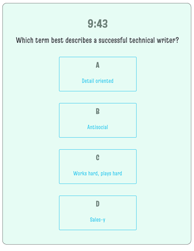
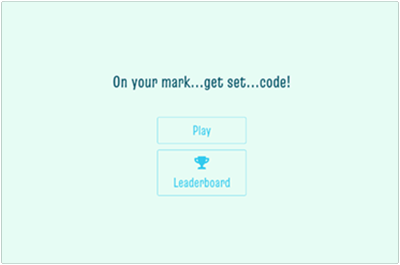
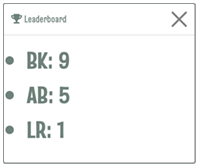

[Released under ](#license) by [@melissakinsey](https://github.com/melissakinsey).

- [Description](#Description)
- [Installation](#Installation)
- [Features](#Features)
- [Technical Specs](#Technical_Specs)
- [Lessons Learned](#Lessons_Learned)
- [Contributions](#Contributions)
- [Credits](#Credits)

# DESCRIPTION

This simple quiz app is composed in HTML/CSS and Javascript. It includes a timer, a scoring mechanism, and a leaderboard showing the initials of the top players. The content focuses on technical writing.

## Project Repo & Demo

The [code for this quiz](https://github.com/melissakinsey/quiz) is housed on GitHub.

## User Story

_AS A_ tech professional _I WANT TO_ take a fun quiz _SO I CAN_ learn more about technical writing.

## Usage

To use this app, open game.js in your local browser. Read the question and choose the best answer among the four choices offered. When you're finished, enter your initials to record your score. Then review the leaderboard to see where you rank compared with other players.

# FEATURES

This app features the following:

- Ten multiple-choice questions
- A timer that begins counting down automatically when the player clicks "Start"
- A penalty mechanism that subtracts time for each wrong answer
- Automatic scoring
- A landing page with a leaderboard button

  

- A leaderboard that allows players to record their scores

  

# TECHNICAL SPECS

- Runs on the command line
- Styled with HTML/CSS and Bootstrap
- Uses a Bootstrap modal to show the leaderboard either before the quiz (from the Leaderboard button on the landing page) or after the quiz (automatically when player's initials are entered)
- Ends game when timer reaches zero

# LESSONS LEARNED

This quiz has a lot of moving parts. I enjoyed bringing in a couple of elements not required by the assignment, such as the landing page and the leaderboard. Except for some special elements (namely, the modal), I found Bootstrap frustrating. I'd rather write my own HTML/CSS than try to override hidden styling that's not to my taste or not suitable for the project.

# CONTRIBUTIONS

This was an individual project. Thanks, as always, to my study group and TAs!

# CREDITS

- Header adapted from image by filo/iStockPhoto.

- Badges created using Michael Currin's nifty [Badge Generator](https://michaelcurrin.github.io/badge-generator/#/repo)

# CONTACT ME

Ping me with questions or project feedback:

- GitHub: [@melissakinsey](https://melissakinsey.github.io/portfolio/)
- Twitter: [@KinseyMelissa](https://twitter.com/KinseyMelissa)
- Email: [kinsey.melissa@gmail.com](mailto:kinsey.melissa@gmail.com)
- LinkedIn: [linkedin.com/melissajaynekinsey](https://www.linkedin.com/in/melissajaynekinsey/)
